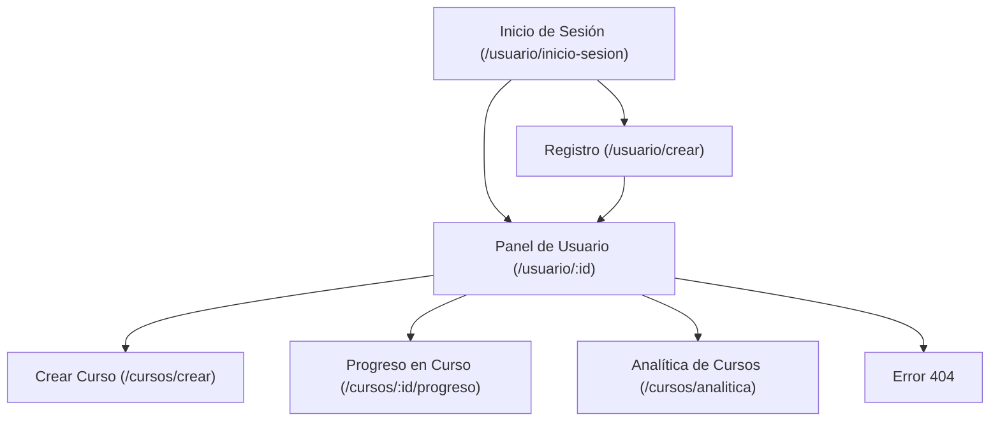
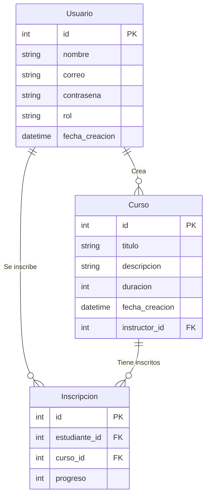

# TechWorld Learning Platform

Una plataforma web diseñada para gestionar cursos de manera eficiente, proporcionando herramientas tanto para estudiantes como para instructores.

## Descripción

TechWorld Learning Platform permite a los usuarios registrarse, inscribirse en cursos, ver su progreso y analizar datos en tiempo real. El proyecto utiliza **Django**, que sigue el patrón **MTV (Modelo-Template-Vista)**, y está diseñado para garantizar escalabilidad, seguridad y facilidad de uso.

### Características principales:

- Registro e inicio de sesión con autenticación segura utilizando el sistema de usuarios de Django.
- Roles diferenciados para estudiantes e instructores.
- Gestión de cursos: creación, inscripción y seguimiento del progreso.
- Panel de analítica para obtener estadísticas básicas de los cursos.
- Diseño responsivo utilizando Bootstrap.
- Uso de variables de entorno con `python-dotenv` para una configuración segura.
- Carga de datos iniciales con **fixtures**.

## Visuales

**Mapa del Sitio:**



---

**Modelo de Datos:**



## Estructura del Proyecto 📂

```plaintext
/techworld                           # Directorio raíz del proyecto Django
├── /users                           # Aplicación "users", encargada de la gestión de usuarios
│   ├── /migrations                  # Migraciones para aplicar cambios al modelo de datos
│   ├── /fixtures                    # Datos iniciales para usuarios
│   │   └── initial_users.json       # Archivo JSON con datos de ejemplo para preconfigurar usuarios
│   ├── admin.py                     # Configuración para mostrar y administrar usuarios desde el panel de Django Admin
│   ├── apps.py                      # Configuración básica de la aplicación "users"
│   ├── forms.py                     # Formularios personalizados para registro, inicio de sesión, etc.
│   ├── models.py                    # Definición de los modelos de datos relacionados con usuarios
│   ├── views.py                     # Vistas para manejar lógica de usuario (login, registro, perfil, etc.)
│   ├── urls.py                      # Rutas específicas para la aplicación "users"
│   └── templates/users              # Plantillas HTML para la aplicación de usuarios
│       ├── login.html               # Página de inicio de sesión
│       └── register.html            # Página de registro de usuarios
├── /courses                         # Aplicación "courses", encargada de la gestión de cursos
│   ├── /migrations                  # Migraciones para aplicar cambios al modelo de datos de cursos
│   ├── /fixtures                    # Datos iniciales para cursos
│   │   └── initial_courses.json     # Archivo JSON con datos de ejemplo para preconfigurar cursos
│   ├── admin.py                     # Configuración para mostrar y administrar cursos desde el panel de Django Admin
│   ├── apps.py                      # Configuración básica de la aplicación "courses"
│   ├── forms.py                     # Formularios personalizados para creación o edición de cursos
│   ├── models.py                    # Definición de los modelos de datos relacionados con cursos e inscripciones
│   ├── views.py                     # Vistas para manejar lógica de cursos (listado, creación, progreso, etc.)
│   ├── urls.py                      # Rutas específicas para la aplicación "courses"
│   └── templates/courses            # Plantillas HTML para la aplicación de cursos
│       ├── create_course.html       # Página para la creación de un nuevo curso
│       ├── course_list.html         # Página para mostrar el listado de cursos disponibles
│       └── progress.html            # Página para mostrar el progreso del estudiante en un curso
├── /static                          # Directorio para archivos estáticos (CSS, JavaScript, imágenes, etc.)
│   ├── /css                         # Archivos CSS personalizados para el diseño de la plataforma
│   │   └── styles.css               # Estilos personalizados para el proyecto
├── /templates                       # Plantillas HTML globales del proyecto
│   ├── base.html                    # Plantilla base utilizada para herencia en otras páginas
│   └── navbar.html                  # Barra de navegación común para todas las páginas
├── /fixtures                        # Datos iniciales globales (opcional)
│   └── initial_data.json            # Archivo JSON que combina datos iniciales de usuarios y cursos
├── db.sqlite3                       # Base de datos SQLite utilizada por defecto (ideal para desarrollo)
├── manage.py                        # Archivo principal para gestionar el proyecto Django
└── requirements.txt                 # Archivo con las dependencias necesarias para el proyecto

```

## Empezando 🚀

Sigue estas instrucciones para obtener una copia funcional del proyecto en tu máquina local.

### Prerrequisitos 📋

- **Sistema Operativo:** Ubuntu 20.04 / Windows 10 / macOS.
- **Python:** Versión 3.10 o superior.
- **Gestor de Paquetes:** pip.
- **Base de Datos:** PostgreSQL.

### Instalación 🔧

1. **Clonar el repositorio:**

```bash
git clone https://github.com/tu-repositorio/techworld.git
cd techworld
```

2. **Crear un entorno virtual:**

```bash
python -m venv venv
source venv/bin/activate  # En Windows: venv\Scripts\activate
```

3. **Instalar dependencias:**

```bash
pip install -r requirements.txt
```

4. **Configurar las variables de entorno:**
   - Crea un archivo `.env` en la raíz del proyecto con el siguiente contenido:

```env
DB_HOST=localhost
DB_PORT=5432
DB_NAME=techworld
DB_USER=tu_usuario
DB_PASSWORD=tu_contraseña
SECRET_KEY=django-super-secret-key
DEBUG=True
```

1. **Configurar la base de datos:**
   - Asegúrate de tener PostgreSQL instalado y en ejecución.
   - Crea una base de datos para el proyecto:

```sql
CREATE DATABASE techworld;
```

6. **Realizar las migraciones:**

```bash
python manage.py makemigrations
python manage.py migrate
```

7. **Cargar los datos iniciales con fixtures:**

   - Para cargar los datos iniciales, utiliza los siguientes comandos:

- Cargar los usuarios:

```bash
python manage.py loaddata users/fixtures/initial_users.json
```

- Cargar los cursos:

```bash
python manage.py loaddata courses/fixtures/initial_courses.json
```

- (Opcional) Cargar todos los datos desde un archivo global:

```bash
python manage.py loaddata fixtures/initial_data.json
```

- (Opcional) Crear un superusuario (si es necesario):

```bash
python manage.py createsuperuser
```

8. **Iniciar el servidor:**

```bash
python manage.py runserver
```

9.  **Abrir la aplicación:**

Accede a `http://127.0.0.1:8000`.

## Construido Con 🛠️

- **Backend:**
  - Django
  - Django ORM
  - python-dotenv
- **Frontend:**
  - Bootstrap
  - Django Templates
- **Base de Datos:**
  - PostgreSQL

## Versionado 📌

Usamos [Git](https://git-scm.com) para el versionado. Ve las [etiquetas](https://github.com/your/project/tags) disponibles.

## Autores ✒️

- **[Brayan Diaz C]** - _Desarrollador principal_ - [GitHub](https://github.com/brayandiazc)
